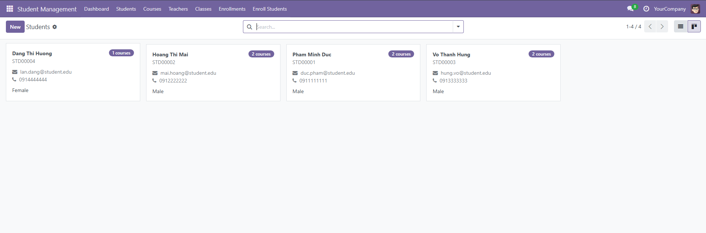
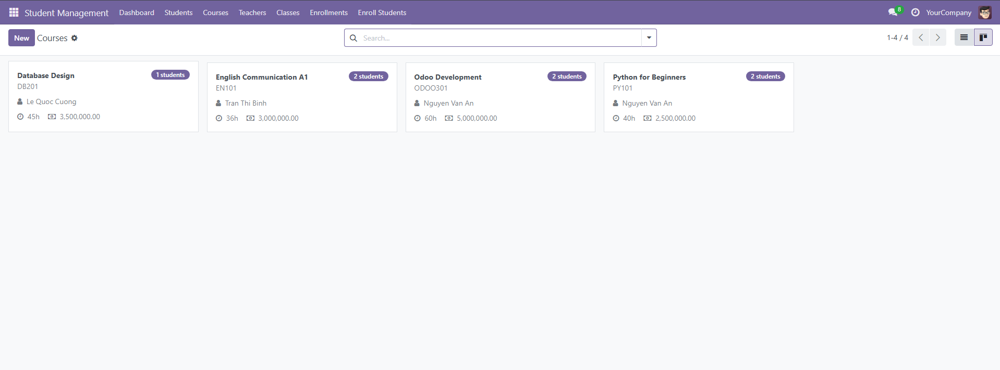
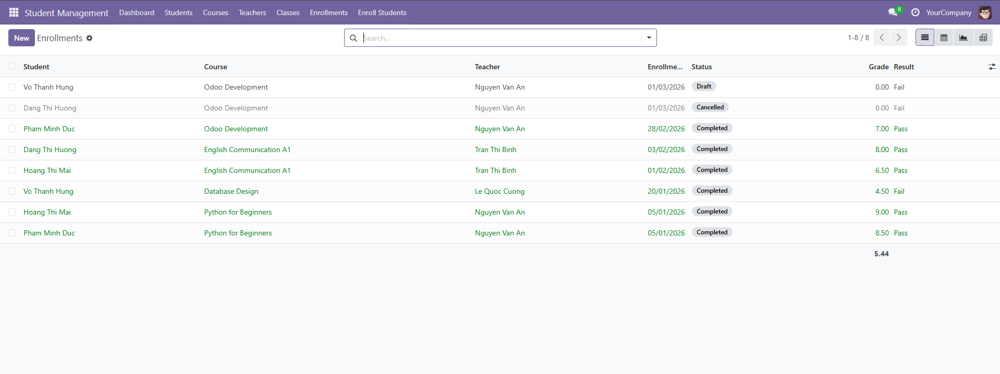
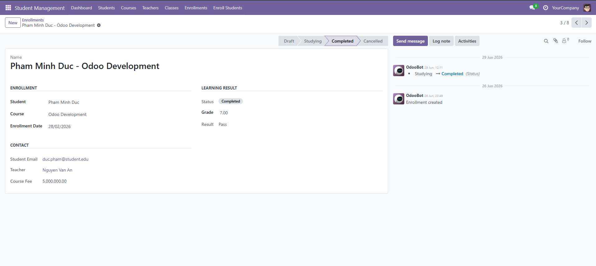
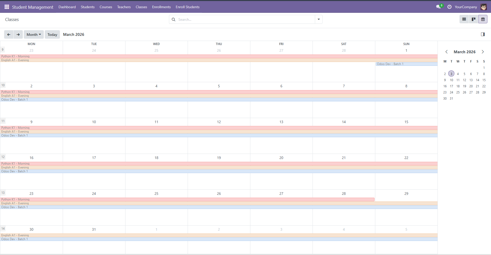
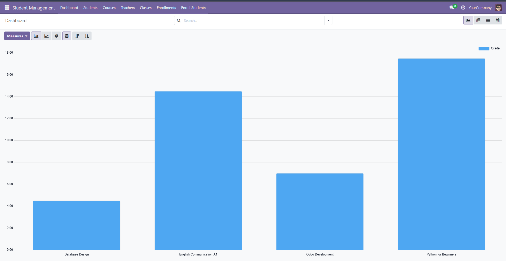
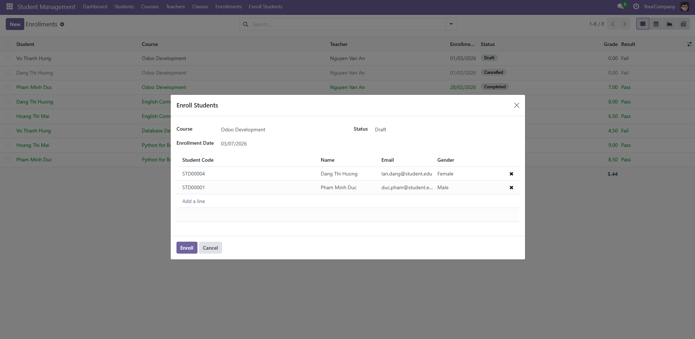
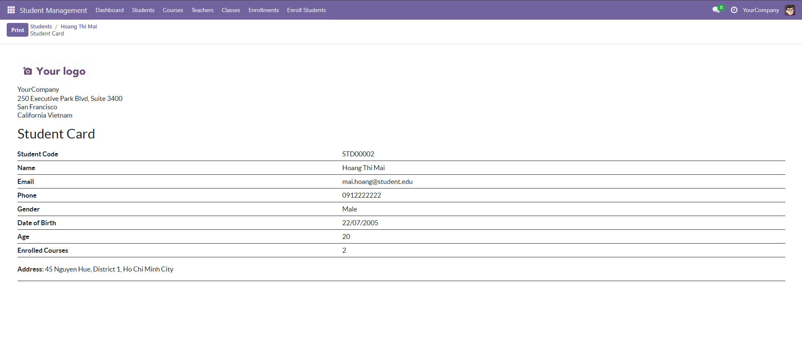

# Student Management - Odoo 18 Module

[](https://www.odoo.com)
[](https://www.python.org)
[](https://www.postgresql.org)
[](LICENSE)

Student Management is an Odoo 18 portfolio module for training centers. It manages students, teachers, courses, classrooms, enrollments, grades, PDF reports, email notifications, scheduled automation, and role-based access control.

**Author:** Nguyen Van Bac

## Highlights

| Area | Implementation |
| --- | --- |
| Core models | Student, Teacher, Course, Classroom, Enrollment |
| Business flow | Enrollment workflow: Draft -> Studying -> Completed / Cancelled |
| User interface | List, form, kanban, calendar, graph, pivot, search filters |
| Data quality | Constraints, computed fields, normalized email/course codes |
| Security | Teacher, Staff, Administrator groups; ACLs; enrollment record rules |
| Automation | Student code sequence, email templates, daily cron job |
| Productivity | Bulk enrollment wizard for registering multiple students |
| Reporting | Student Card, Student List by Course, Class Grade Report |
| Tests | TransactionCase tests for key business rules |

## Business Workflow

```text
Create teachers
-> Create courses
-> Create students
-> Enroll students into courses
-> Start studying
-> Enter grades
-> Complete enrollments
-> Print reports and analyze dashboards
```

Enrollment statuses:

```text
Draft -> Studying -> Completed
Draft/Studying -> Cancelled -> Draft
```

## Key Features

- Auto-generated student codes such as `STD00001`.
- Duplicate enrollment prevention for the same student and course.
- Grade validation from `0` to `10`.
- Automatic Pass/Fail result based on grade.
- Teacher notification when a new enrollment is created.
- Student notification when an enrollment starts studying.
- Daily cron that auto-completes studying enrollments older than 90 days if they already have a grade.
- Portfolio-friendly backend UI with kanban cards, list decorations, calendar schedule, graph and pivot analysis.

## Screenshots

Selected Odoo backend screens from the module demo database.

| Students Kanban | Courses Kanban |
| --- | --- |
|  |  |

| Enrollments List | Enrollment Form |
| --- | --- |
|  |  |

| Classes Calendar | Dashboard |
| --- | --- |
|  |  |

| Bulk Enroll Wizard | Student Card Report |
| --- | --- |
|  |  |

## Requirements

- Odoo 18
- Python 3.10+
- PostgreSQL

## Installation

```bash
# 1. Clone into your Odoo custom addons path
git clone https://github.com/bacnguyen2004/student_management.git custom_addons/student_management

# 2. Ensure addons_path includes custom_addons in odoo.conf
# addons_path = addons,custom_addons

# 3. Restart Odoo, update the apps list, then install the module
# Apps -> Update Apps List -> search "student_management" -> Install
```

Optional: enable demo data to load sample students, teachers, courses, classrooms, and enrollments.

Upgrade after code changes:

```text
Apps -> student_management -> Upgrade
```

## Security Groups

| Group | Access |
| --- | --- |
| Teacher | Read core records and manage enrollments for their own courses |
| Staff | Manage module records without delete permission |
| Administrator | Full module access |

Teacher access depends on linking a teacher record to an Odoo user:

```text
Student Management -> Teachers -> User
```

## Run Tests

```bash
./odoo-bin -c odoo.conf -d test_db -i student_management --test-enable --stop-after-init
```

## Module Structure

```text
student_management/
|-- models/          # ORM models and business logic
|-- views/           # XML views, actions, menus, dashboards
|-- wizard/          # TransientModel wizard for bulk enrollment
|-- report/          # QWeb PDF report actions and templates
|-- security/        # Groups, ACLs, and record rules
|-- data/            # Sequence, mail templates, scheduled action
|-- demo/            # Demo records for portfolio screenshots
|-- tests/           # TransactionCase tests
`-- static/          # Module icon and app description
```

## Tech Stack

- **Backend:** Python, Odoo ORM, computed fields, constraints, scheduled actions
- **Frontend:** Odoo XML views, kanban, calendar, graph, pivot, search views
- **Security:** `res.groups`, `ir.model.access.csv`, `ir.rule`
- **Reporting:** QWeb PDF reports
- **Messaging:** `mail.template`, chatter, email queue integration
- **Testing:** `odoo.tests.TransactionCase`

## License

[LGPL-3.0](LICENSE)
